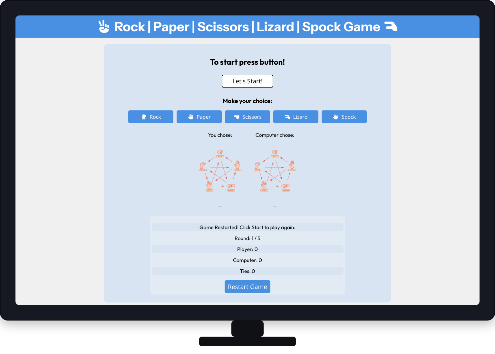
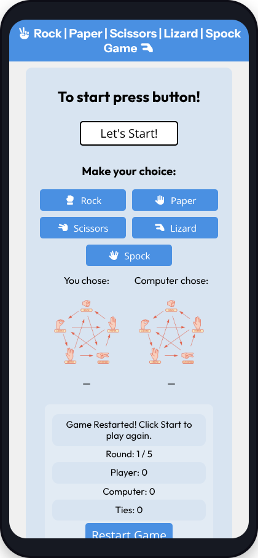
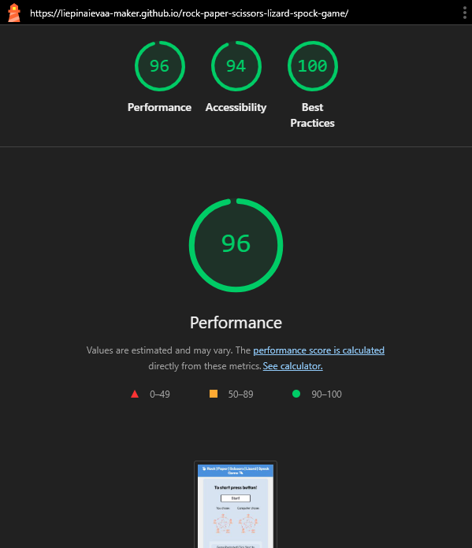
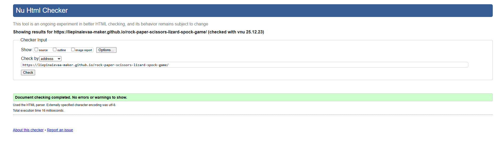
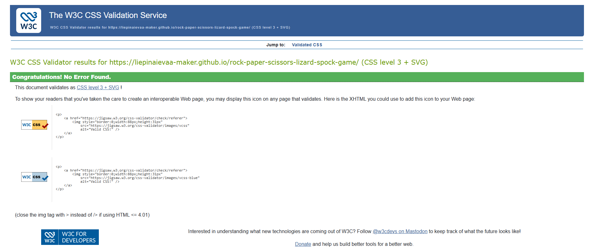
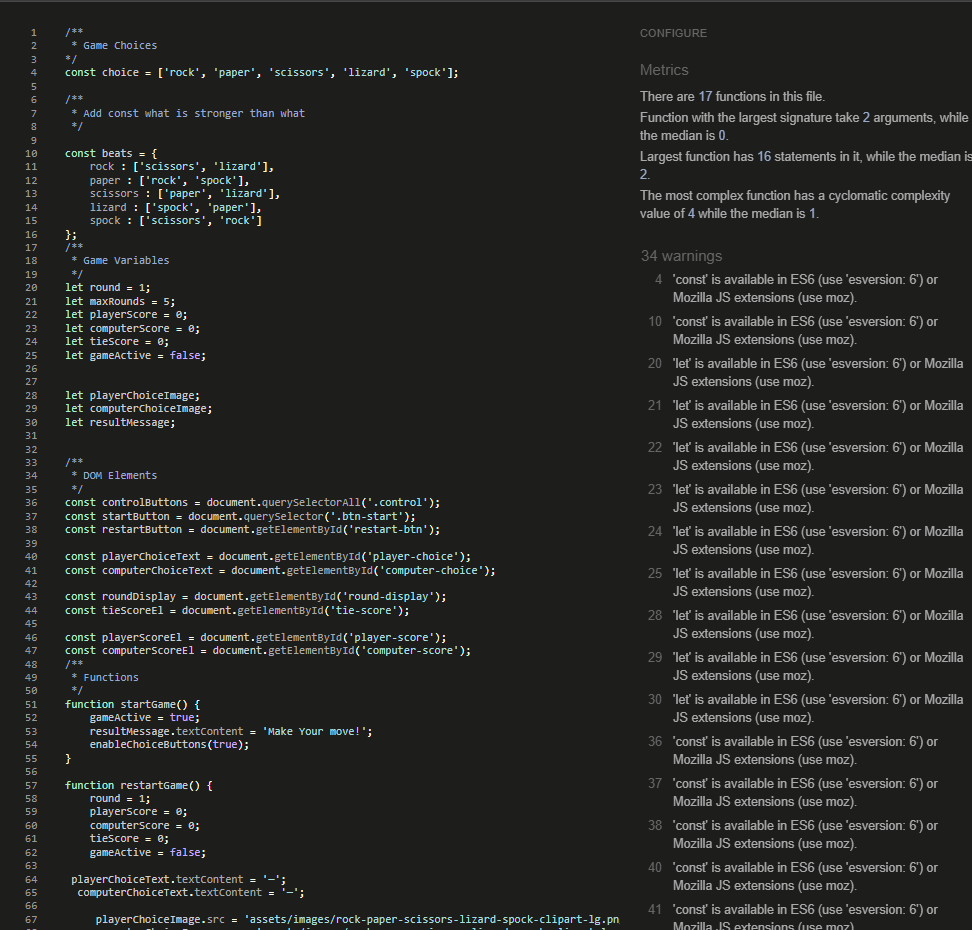

# Testing

Extensive testing was carried out throughout the development process to ensure that the Rock, Paper, Scissors, Lizard, Spock game functions correctly, delivers accurate game logic, and provides a smooth and intuitive user experience across different devices and browsers.

The game was tested manually to confirm that all interactive elements respond correctly to user input, that results are calculated accurately based on the game rules, and that feedback is clearly displayed after each round. Testing focused on ensuring that users can easily understand the gameplay, track their progress, and restart the game without issues. 

## General Functionality Testing

- All game option buttons (Rock, Paper, Scissors, Lizard, Spock) correctly register user input when clicked.
- The computer opponent generates a random choice each round, ensuring unpredictable gameplay.
- Game rules are applied correctly for all possible combinations, resulting in accurate win, loss, or tie outcomes.
- Player score, computer score, and tie count update correctly after each round.
- The round-based system progresses as expected and ends the game after the defined number of rounds.
- Visual feedback clearly displays both the player’s and the computer’s choices after each round.
- Status messages guide the user through gameplay, indicating when to make a move and displaying round results.
- The restart button successfully resets scores, rounds, and game state without requiring a page refresh.
- All elements remain properly aligned, readable, and usable throughout gameplay.

## Manual Testing

- The Rock, Paper, Scissors, Lizard, Spock game was manually tested using a range of user interactions to confirm correct functionality, accurate game logic, and clear feedback throughout gameplay.

#### Browser Testing

- The game was tested on the following browsers:

  - Google Chrome (Desktop&Mobile)

  - Mozilla Firefox

  - Microsoft Edge

  - Brave

  - Safari (iOs)

- The game performed consistently across all browsers with no layout or functionality issues observed:

 - Desktop (Full HD & 4K)

 - Tablet (768px width)

 - Mobile Devices (480px and smaller)

- The website’s responsiveness was verified using Chrome DevTools and actual physical devices to ensure consistent layout behavior across breakpoints.

#### Responsive Testing

- The site was tested on multiple screen sizes using browser developer tools:

  - Desktop (large screens)

  

  - Tablet view

  - Mobile view

  

- The layout adapts correctly on all screen sizes. Buttons remain accessible, text remains readable, and gameplay is not affected on smaller devices.

---

### Validator testing

#### Performance and accessibility 
- Performance, accessibility, and best practices were evaluated using Google Lighthouse, with the game achieving high scores across all categories. This confirms that the site is well structured, accessible, and optimised according to modern web standards.

- Lighthouse on Desktop version

- Lighthouse on Mobile version

- #### HTML

  - No errors were returned when passing the HTML through the official W3C Markup Validator.

- The game was tested using the [W3C Markup Validation Service](https://validator.w3.org/nu/?doc=https%3A%2F%2Fliepinaievaa-maker.github.io%2Frock-paper-scissors-lizard-spock-game%2F)

- #### CSS

  - No errors were found when passing the CSS through the official W3C (Jigsaw) Validator.

- The game was tested using the [CSS](https://jigsaw.w3.org/css-validator/validator?uri=https%3A%2F%2Fliepinaievaa-maker.github.io%2Frock-paper-scissors-lizard-spock-game%2F&profile=css3svg&usermedium=all&warning=1&vextwarning=&lang=en)

- #### JavaScript

 - No errors were found when passing the JavaScript through the JSHint Validator.

 - The game’s JavaScript was tested using browser developer tools and the [JSHint](https://jshint.com/) online validator.

 The following metrics were returned by JSHint:

 - The script contains multiple functions used to control game logic and DOM interaction.

 - The function with the largest signature takes a small number of arguments.

 - The most complex function has a low cyclomatic complexity value, indicating readable and maintainable code.

---

| **Feature** | **Test action** | **Expected Result** | **Outcome** | **Comments** |
|-------------------------------------|-----------|----------------|----------|-----------|
| Game buttons | Click each option (Rock, Paper, Scissors, Lizard, Spock) | Player choice is registered | Pass | Input correctly passed via data attributes |
| Computer choice | Start a round | Computer selects a random option | Pass | Uses Math.random for unpredictability |
| Rule logic | Play multiple rounds with different combinations | Correct win/lose/tie result displayed | Pass | Extended rule set tested |
| Score tracking | Win, lose, or tie a round | Scores update correctly | Pass | DOM updated in real time |
| Round limit | Complete all rounds | Game ends and final result shown | Pass | Prevents infinite gameplay |
| Restart button | Click restart during or after game | Scores and rounds reset | Pass | Game state fully reset |
| Visual feedback | Complete a round | Player and computer choices displayed | Pass | Images and text update together |
| Status messages | Start and play the game | Clear guidance shown on screen | Pass | Helps first-time users |
| Start button visibility control | Load page without clicking Start | Game choice buttons are hidden | Pass | Prevents interaction before game starts |
| Start button interaction | Click Start button | Game choice buttons appear and become clickable | Pass | Improves user flow |
| Restart visibility reset | Click Restart after starting game | Game choice buttons are hidden again until Start is clicked | Pass | Ensures clean game reset |

---

#### Bugs and Issues Found During Testing

- **During development and testing, several issues were identified and resolved:**

 - **JavaScript code overwriting:** 
   - In some cases, functions and variables in the JavaScript file were unintentionally overwritten due to repeated declarations. This caused unexpected behaviour in the game logic, such as scores not updating correctly or event handlers not firing. The issue was resolved by reviewing the script structure, removing duplicate code, and ensuring each function and variable was defined only once.

- **Case sensitivity errors in JavaScript:**
  - JavaScript is case-sensitive, and in a few instances incorrect use of uppercase and lowercase letters (for example, mismatched variable or function names) caused the script to stop working as expected. These issues were identified through debugging and console error messages and fixed by ensuring consistent naming conventions throughout the JavaScript file.

- **Favicon link error:**
  - An incorrect favicon link caused a console error when the site loaded. This was resolved by replacing the favicon link with a correctly generated and properly referenced favicon file, ensuring the error no longer appeared and improving cross-browser compatibility.
--- 
### Unfixed Bugs

- At the time of submission, there are no known unfixed bugs that significantly affect the functionality or usability of the game..

- All known issues discovered during development and testing were resolved before deployment. Any remaining limitations, such as the computer opponent using a fully random strategy rather than adaptive difficulty, are considered design choices and documented in the Features Left to Implement section rather than being classified as bugs.

---